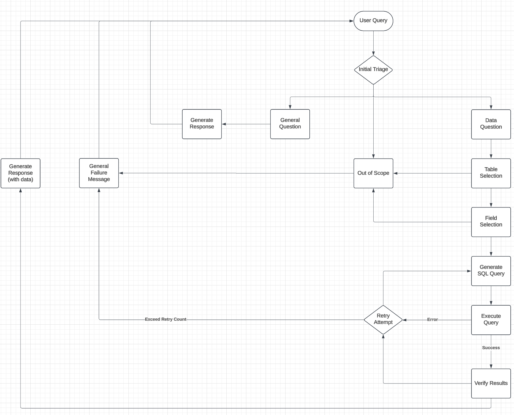

# AI SQL Query Generator

A demonstration application showcasing Query RAG (Retrieval-Augmented Generation) capabilities with AI-powered SQL query generation. This application allows users to upload CSV files, automatically analyze their contents, and use natural language to query the data through an AI workflow.

[](https://youtu.be/5LIfSpr3GDM)
> 🎥 Learn about Query RAG and how it works!

## Features

- 📤 CSV file upload with drag-and-drop support
- 📊 Automatic schema detection and PostgreSQL table creation
- 🤖 AI-powered natural language to SQL conversion
- 🔍 Smart query analysis and validation
- 💡 Intelligent error handling and query regeneration
- 🎯 Context-aware responses based on available data

## Architecture

The application consists of two main components:



### Frontend (`ui/src/App.tsx`)
- React-based UI utilizing TypeScript and shadcn/ui components
- Enables users to upload CSV files and query the data using natural language

### Backend (`server/src`)
- Express.js server with TypeScript
- PostgreSQL database integration
- Multi-step AI query processing pipeline:
  1. Query triage and classification
  2. Schema analysis and table profiling
  3. SQL generation
  4. Result formatting
  5. Answer validation

### Table Analyzer (`server/src/tableAnalyzer.ts`)
The table analyzer component performs intelligent data profiling:
- Samples data from uploaded tables
- Analyzes column types, distinct values, and null ratios
- Generates statistical summaries (min/max for numeric/dates)
- Creates AI-powered descriptions of each field
- Provides context for more accurate query generation

## Setup

1. Install dependencies:

# Frontend
```
cd ui
npm install
```

# Backend
1. Install dependencies:
```
cd server
npm install
```

2. Set up your PostgreSQL database and configure environment variables:
   Copy the `.env.sample` file to `.env` and update the values:

```env
DB_USER=postgres
DB_HOST=localhost
DB_NAME=sqlgen
DB_PASSWORD=admin
DB_PORT=5432
PORT=3000
OPENAI_API_KEY=your_openai_api_key
```

3. Start the development servers:

# Frontend
```
cd ui
npm run dev
```

# Backend
```
cd server
npm run dev
```

## How It Works

1. **CSV Upload**
   - Upload a CSV file through drag-and-drop or file selection
   - The server automatically detects column types and creates a PostgreSQL table
   - Table schema is analyzed and stored for future queries

2. **Query Processing**
   - User enters a natural language question
   - Query is classified as general, data-specific, or out-of-scope
   - For data queries:
     - Available schema is analyzed for relevance
     - SQL query is generated using AI
     - Results are formatted into natural language
     - Response is validated for accuracy

3. **Error Handling**
   - Multiple retry attempts for failed queries
   - Context-aware error messages
   - Query regeneration with previous error context

## Example Usage

1. Upload a CSV file:
   ```
   Drag and drop your CSV file into the upload area
   Enter a table name for your data
   Click "Upload CSV"
   ```

2. Query your data:
   ```
   "Show me the total sales by region for last month"
   "What was the average order value per customer?"
   "Which products had the highest growth rate?"
   ```

## Technical Details

The application uses a sophisticated prompt engineering approach to generate accurate SQL queries:

- Query classification to determine appropriate response type
- Schema analysis to identify relevant tables and relationships
- PostgreSQL-specific query generation with best practices
- Multi-step validation to ensure accurate responses
- Error recovery with context-aware query regeneration

## Contributing

This is a proof of concept and is not intended for production use. This repository is for educational purposes and will not be maintained. Please feel free to fork and maintain your own version!

## License

MIT License - feel free to use this code for your own projects!